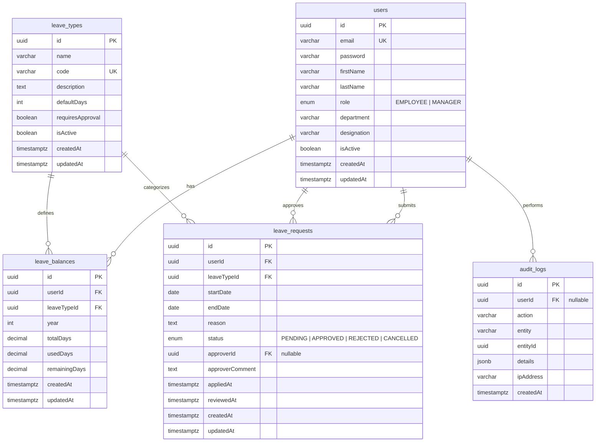

# Entity Relationship Diagram



---

## Relationship Summary

| Relationship | Type | Source | Target | Cardinality |
|---|---|---|---|---|
| Has balances | 1-to-Many | `users` | `leave_balances` | A user can have many leave balance records (one per leave type per year). |
| Submits requests | 1-to-Many | `users` | `leave_requests` | A user can submit many leave requests. |
| Approves requests | 1-to-Many | `users` | `leave_requests` | A manager (approver) can review many leave requests. |
| Performs audits | 1-to-Many | `users` | `audit_logs` | A user can have many audit log entries. |
| Defines balances | 1-to-Many | `leave_types` | `leave_balances` | A leave type defines the balance structure for many users. |
| Categorizes requests | 1-to-Many | `leave_types` | `leave_requests` | A leave type classifies many leave requests. |

---

## Key Constraints

- **Composite unique** on `leave_balances`: `(userId, leaveTypeId, year)`
- **Unique code** on `leave_types`: `code`
- **Unique email** on `users`: `email`
- **Check constraint**: `leave_requests.startDate <= leave_requests.endDate`

---

## Referential Actions

```
users.id → leave_balances.userId   : ON DELETE CASCADE
users.id → leave_requests.userId    : ON DELETE CASCADE
users.id → leave_requests.approverId : ON DELETE SET NULL
users.id → audit_logs.userId        : ON DELETE SET NULL

leave_types.id → leave_balances.leaveTypeId  : ON DELETE RESTRICT
leave_types.id → leave_requests.leaveTypeId  : ON DELETE RESTRICT
```
