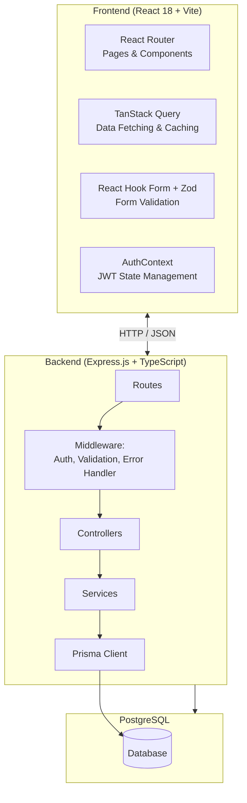
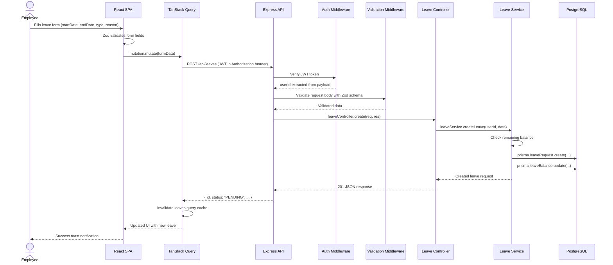

# Proteccio Architecture

## System Overview

Proteccio is a full-stack Employee Leave Management System built with **React 18** on the frontend and **Express.js** on the backend, backed by a **PostgreSQL** database. The frontend communicates with the backend via a RESTful JSON API. Authentication is handled via JWT tokens stored in `localStorage`.

| Layer | Technology |
|---|---|
| Frontend | React 18, TypeScript, Vite, Tailwind CSS, shadcn/ui |
| Backend | Express.js, TypeScript, Prisma ORM |
| Database | PostgreSQL |
| Auth | JWT (jsonwebtoken + bcryptjs) |

---

## High-level Architecture Diagram



---

## Frontend Architecture

The frontend is a Single Page Application (SPA) built with **Vite** as the build tool.

### Key Libraries

- **React 18** with TypeScript
- **React Router v6** — Client-side routing (pages: Login, Register, Dashboard, Leaves, LeaveReview, Employees)
- **TanStack Query v5** — Server state management, caching, and automatic refetching
- **React Hook Form + Zod** — Performant form management with schema-based validation
- **Tailwind CSS + shadcn/ui** — Utility-first styling with Radix UI primitives
- **Axios** — HTTP client for API calls
- **date-fns** — Date manipulation
- **Sonner** — Toast notifications

### Directory Structure

```
frontend/src/
├── components/
│   ├── auth/          # Login/Register form components
│   ├── dashboard/     # Dashboard widgets
│   ├── employees/     # Employee management components
│   ├── layout/        # App shell (Sidebar, Header, Layout)
│   ├── leaves/        # Leave request forms, cards, filters
│   └── ui/            # shadcn/ui primitives (button, dialog, etc.)
├── config/            # App configuration constants
├── contexts/
│   └── AuthContext.tsx # JWT auth state provider
├── hooks/             # Custom React hooks
├── lib/
│   └── utils.ts       # Tailwind CSS utility (cn)
├── pages/
│   ├── DashboardPage.tsx
│   ├── EmployeesPage.tsx
│   ├── LeaveReviewPage.tsx
│   ├── LeavesPage.tsx
│   ├── LoginPage.tsx
│   └── RegisterPage.tsx
├── services/
│   ├── api.ts         # Axios instance with interceptors
│   ├── authService.ts # Auth API calls
│   ├── leaveService.ts# Leave API calls
│   └── userService.ts # User API calls
├── types/             # Shared TypeScript interfaces
├── App.tsx            # Root component with router
└── main.tsx           # Entry point
```

### Routing

| Path | Page | Access |
|---|---|---|
| `/login` | LoginPage | Public |
| `/register` | RegisterPage | Public |
| `/dashboard` | DashboardPage | Authenticated |
| `/leaves` | LeavesPage | Authenticated |
| `/leaves/review` | LeaveReviewPage | Manager |
| `/employees` | EmployeesPage | Manager |

---

## Backend Architecture

The backend follows a **layered architecture**: Routes -> Controllers -> Services -> Prisma -> DB.

### Key Libraries

- **Express.js** with TypeScript
- **Prisma ORM** — Type-safe database access and migrations
- **JWT (jsonwebtoken)** — Authentication tokens
- **bcryptjs** — Password hashing
- **helmet** — Security headers
- **morgan** — HTTP request logging
- **cors** — Cross-Origin Resource Sharing
- **swagger-ui-express + swagger-jsdoc** — API documentation
- **zod** — Request validation schemas

### Directory Structure

```
backend/src/
├── config/
│   ├── index.ts       # Env config loader
│   ├── prisma.ts      # Prisma client singleton
│   └── swagger.ts     # Swagger setup
├── controllers/
│   ├── authController.ts
│   ├── leaveController.ts
│   └── userController.ts
├── middleware/
│   ├── auth.ts        # JWT verification middleware
│   ├── errorHandler.ts# Global error handler
│   └── validate.ts    # Zod schema validation middleware
├── routes/
│   ├── authRoutes.ts
│   ├── leaveRoutes.ts
│   └── userRoutes.ts
├── services/
│   ├── authService.ts
│   ├── leaveService.ts
│   └── userService.ts
├── types/             # TypeScript interfaces/types
├── utils/             # Utility functions
├── validators/
│   ├── authValidators.ts
│   ├── leaveValidators.ts
│   └── userValidators.ts
├── app.ts             # Express app setup
└── index.ts           # Server entry point
```

### Layered Request Flow

```
HTTP Request
    ↓
Route (defines path + middleware chain)
    ↓
Middleware (auth check, validation)
    ↓
Controller (parses request, calls service, sends response)
    ↓
Service (business logic, orchestrates Prisma calls)
    ↓
Prisma Client (type-safe query builder)
    ↓
PostgreSQL
```

### API Endpoints

| Method | Path | Controller | Auth |
|---|---|---|---|
| POST | `/api/auth/register` | authController | No |
| POST | `/api/auth/login` | authController | No |
| GET | `/api/auth/me` | authController | JWT |
| GET | `/api/users` | userController | JWT + Manager |
| GET | `/api/leaves` | leaveController | JWT |
| POST | `/api/leaves` | leaveController | JWT |
| PATCH | `/api/leaves/:id/review` | leaveController | JWT + Manager |

---

## Data Flow: Submitting a Leave Request



---

## Folder Structure

```
proteccio/
├── backend/
│   ├── prisma/
│   │   ├── migrations/    # Prisma migration history
│   │   └── schema.prisma  # Database schema definition
│   └── src/
│       ├── config/        # App configuration, Prisma client, Swagger
│       ├── controllers/   # Request/response handling
│       ├── middleware/     # Auth, validation, error handling
│       ├── routes/        # Express route definitions
│       ├── services/      # Business logic layer
│       ├── types/         # Shared type definitions
│       ├── utils/         # Helper functions
│       ├── validators/    # Zod validation schemas
│       ├── app.ts         # Express app configuration
│       ├── index.ts       # Server entry point
│       └── seed.ts        # Database seeder
├── database/
│   ├── database-schema.md # Detailed table definitions
│   └── ERD.md             # Entity Relationship Diagram
├── docs/                  # Project documentation
├── frontend/
│   └── src/
│       ├── components/    # Reusable UI components
│       │   ├── auth/
│       │   ├── dashboard/
│       │   ├── employees/
│       │   ├── layout/
│       │   ├── leaves/
│       │   └── ui/        # shadcn/ui primitives
│       ├── config/        # App constants
│       ├── contexts/      # React contexts (AuthContext)
│       ├── hooks/         # Custom hooks
│       ├── lib/           # Utility functions
│       ├── pages/         # Route-level page components
│       ├── services/      # API service layer
│       └── types/         # TypeScript interfaces
├── postman/               # Postman collection
├── README.md
└── .gitignore
```
